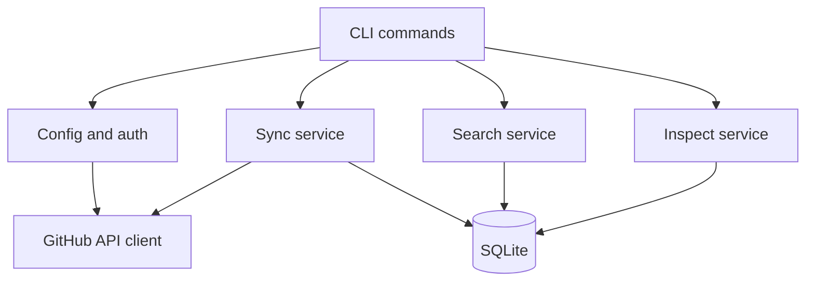
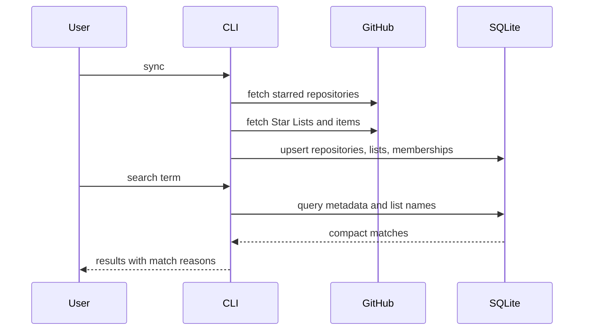

# feat: Build GitHub star search CLI

## Summary

Build a greenfield Node.js CLI that syncs the authenticated user's GitHub starred repositories and GitHub Star Lists into local SQLite, then searches repo name, description, and list membership from the terminal.

---

## Problem Frame

GitHub stars and Star Lists already contain the user's personal repository bookmarks, but GitHub's UI does not make it fast to search across the collection and the lists the user created. The requirements emphasize private and public Star Lists equally: if the authenticated user can see or manage a list, the CLI should index it locally and preserve its privacy.

The repo currently has no application code, so the plan establishes the initial Node.js CLI structure, persistence model, GitHub integration boundary, and test coverage for the MVP described in `docs/brainstorms/2026-06-04-github-star-search-requirements.md`.

---

## Requirements

**Project Foundation**

- R1. The repository provides a Node.js CLI entrypoint with TypeScript source, automated tests, lint/typecheck support, and documented setup.
- R2. CLI configuration accepts a GitHub token and a local database path without hardcoding user secrets.

**GitHub Sync**

- R3. The CLI syncs the authenticated user's starred repositories into local SQLite.
- R4. The CLI syncs GitHub Star Lists created or managed by the authenticated user, including public and private lists when the token permits access.
- R5. Sync records list membership so a repository can display the Star Lists that contain it.
- R6. Sync is repeatable and updates existing records without requiring manual local reset.
- R7. Private list metadata remains local and is never published or synced back to GitHub by default.

**Local Search and Inspect**

- R8. The CLI searches locally by repository name and description.
- R9. The CLI can match or filter by Star List name.
- R10. Search results are compact and show repo full name, description, language when available, list membership when available, URL, and match reason.
- R11. The CLI can inspect one repository and show stored metadata plus list membership.
- R12. Search and inspect operate from local data after sync rather than performing live GitHub search at query time.

**MVP Boundaries**

- R13. README text indexing, semantic search, AI features, local-only notes/categories, and web UI are deferred.
- R14. The implementation leaves a clear extension path for README indexing after metadata and list-aware search work.

---

## Key Technical Decisions

- **Node.js with TypeScript:** The user selected Node.js. TypeScript gives the greenfield CLI stronger API and persistence contracts without much overhead.
- **SQLite as the local source of search:** SQLite fits the single-user local workflow and can support full-text search for repository metadata without a service dependency.
- **GitHub API boundary is read-only for MVP:** Sync reads stars and Star Lists but does not create, edit, publish, or mutate lists. This keeps privacy posture simple and aligns with the brainstorm's local-search goal.
- **REST for starred repos, GraphQL for Star Lists:** GitHub REST documents `GET /user/starred` for the authenticated user's starred repositories. GitHub GraphQL documents `UserList`, including `isPrivate` and `items`, which makes GraphQL the likely source for Star List metadata and membership.
- **API schema verification comes first:** Star Lists are the highest-risk integration surface. The implementation should start by proving the authenticated GraphQL query shape against the current GitHub schema before building the rest of sync around it.
- **FTS-backed search with explicit match reasons:** Search should use SQLite full-text search for repo name and description, then combine that with list-name matching so result rows can explain why each repository matched.

---

## High-Level Technical Design



The CLI has three user-facing behaviors: sync, search, and inspect. Sync is the only behavior that talks to GitHub. Search and inspect read from SQLite so repeated lookups stay fast and private.



---

## Output Structure

```text
package.json
tsconfig.json
vitest.config.ts
README.md
src/
  cli.ts
  config.ts
  github/
    client.ts
    sync.ts
  db/
    connection.ts
    schema.ts
    repositories.ts
  search/
    search.ts
    format.ts
  inspect/
    inspect.ts
test/
  fixtures/
  github-client.test.ts
  sync.test.ts
  search.test.ts
  inspect.test.ts
```

The exact file split may adjust during implementation, but the project should keep CLI parsing, GitHub access, persistence, search, and output formatting separated.

---

## Implementation Units

### U1. Project scaffold and CLI shell

- **Goal:** Establish the Node.js TypeScript CLI project with command parsing, configuration loading, test harness, and initial documentation.
- **Requirements:** R1, R2
- **Dependencies:** None
- **Files:** `package.json`, `tsconfig.json`, `vitest.config.ts`, `README.md`, `src/cli.ts`, `src/config.ts`, `test/cli.test.ts`, `test/config.test.ts`
- **Approach:** Create a small CLI with `sync`, `search`, and `show` command surfaces. Configuration should read a GitHub token from environment or a documented CLI option, and read/write the database at a configurable local path.
- **Patterns to follow:** No local app patterns exist. Prefer small modules and dependency injection around IO so tests can run without live GitHub or a real user database.
- **Test scenarios:**
  - Running the CLI with no command shows help and exits without attempting GitHub or database access.
  - `sync`, `search`, and `show` parse their expected arguments and pass normalized options to command handlers.
  - Missing GitHub token produces a clear configuration error for `sync`.
  - A custom database path is accepted and passed to command handlers.
- **Verification:** A contributor can install dependencies, run tests, and see the CLI help text without providing a token.

### U2. SQLite schema and repository layer

- **Goal:** Create local persistence for repositories, Star Lists, list membership, and metadata search.
- **Requirements:** R3, R4, R5, R6, R7, R8, R9, R12, R14
- **Dependencies:** U1
- **Files:** `src/db/connection.ts`, `src/db/schema.ts`, `src/db/repositories.ts`, `test/db-schema.test.ts`, `test/repositories.test.ts`
- **Approach:** Define tables for repositories, Star Lists, and many-to-many membership. Add an FTS index for searchable repository name and description. Keep private/public list state as stored metadata but do not introduce any outbound sync concept.
- **Technical design:** Directional schema concepts are repositories, lists, repo-list memberships, and an FTS projection. The implementer should choose the exact migration mechanism during setup, but schema creation must be deterministic and idempotent.
- **Patterns to follow:** Keep SQL access behind repository functions rather than scattering queries through CLI handlers.
- **Test scenarios:**
  - Schema initialization can run twice without destroying existing repository or list rows.
  - Upserting the same repository updates metadata without duplicating it.
  - Upserting the same list preserves its stable identity and privacy flag.
  - Updating list membership replaces stale memberships for a synced list.
  - Repository name and description are indexed for local full-text lookup.
- **Verification:** Tests prove the local data model can represent one repo in multiple public/private lists and can refresh that membership.

### U3. GitHub API client for stars and Star Lists

- **Goal:** Implement a read-only GitHub client that fetches starred repositories and the authenticated user's public/private Star Lists.
- **Requirements:** R3, R4, R5, R6, R7
- **Dependencies:** U1
- **Files:** `src/github/client.ts`, `test/github-client.test.ts`, `test/fixtures/github-starred.json`, `test/fixtures/github-user-lists.json`
- **Approach:** Use REST for starred repositories and GraphQL for Star Lists. Normalize API responses into internal records so downstream sync does not depend on raw GitHub payload shapes.
- **Execution note:** Start by proving the Star Lists GraphQL query shape against GitHub's current schema, then lock the local client tests around fixture responses.
- **Patterns to follow:** Keep API pagination explicit and testable. Use mocked HTTP responses in unit tests; do not require live GitHub for normal test runs.
- **Test scenarios:**
  - Covers F1 / AE2. Paginated starred repository responses are combined into normalized repository records.
  - Covers AE3. A private Star List fixture produces list metadata with `isPrivate` preserved and repository membership attached.
  - Covers AE4. A public Star List fixture uses the same normalization path as a private list.
  - API authentication errors are reported without writing partial misleading data.
  - Rate-limit or forbidden responses produce actionable sync errors.
- **Verification:** The client can fetch or fixture-parse starred repositories and Star List membership without mutating GitHub data.

### U4. Sync orchestration

- **Goal:** Wire GitHub client data into SQLite so `sync` refreshes repositories, lists, and memberships in one repeatable operation.
- **Requirements:** R3, R4, R5, R6, R7, R12
- **Dependencies:** U2, U3
- **Files:** `src/github/sync.ts`, `src/cli.ts`, `test/sync.test.ts`
- **Approach:** The sync command should fetch starred repos and lists, then persist them transactionally enough that a failed list fetch does not leave local data pretending to be complete. Report counts for repositories, lists, and memberships.
- **Patterns to follow:** Keep orchestration separate from API client and persistence modules so failures can be tested at boundaries.
- **Test scenarios:**
  - Covers F1 / AE2. A successful sync writes repositories, lists, and memberships and prints a concise summary.
  - Re-running sync with changed repo metadata updates local rows.
  - Re-running sync with changed list membership removes stale membership for the affected list.
  - A private list remains local-only metadata after sync.
  - If Star List fetch fails after repo fetch succeeds, the user sees that list sync failed and the app does not claim list membership is current.
- **Verification:** A fixture-backed sync produces searchable local data for repos in public and private lists.

### U5. Local search command and compact output

- **Goal:** Implement `search <query>` over local repository metadata and Star List names with compact, explainable results.
- **Requirements:** R8, R9, R10, R12
- **Dependencies:** U2, U4
- **Files:** `src/search/search.ts`, `src/search/format.ts`, `src/cli.ts`, `test/search.test.ts`
- **Approach:** Query SQLite FTS for repo name/description matches and join list membership for list-name matches or filtering. Format results with repo full name, description, language, list names, URL, and match reason.
- **Technical design:** Directional search modes are free-text metadata search and list-aware search. If a query matches both metadata and list name, the result should be de-duplicated and show combined reasons.
- **Patterns to follow:** Keep search result calculation separate from terminal formatting so ranking and display can evolve independently.
- **Test scenarios:**
  - Covers F2 / AE1. A term in a repository description returns that repository with a description match reason.
  - Covers AE3. Searching a private list name returns repositories in that list without special-case behavior.
  - Covers AE4. Searching a public list name returns repositories in that list using the same code path.
  - A repository matching both description and list name appears once with both reasons represented.
  - Searching before sync returns an empty-state message rather than an error stack.
  - Result formatting remains compact for long descriptions and multiple list names.
- **Verification:** Fixture data can be searched by repo term and by private/public list name from the CLI.

### U6. Repository inspection command

- **Goal:** Implement `show <repo>` so a user can inspect a matched repository and confirm whether it is the one they wanted.
- **Requirements:** R10, R11, R12
- **Dependencies:** U2, U4
- **Files:** `src/inspect/inspect.ts`, `src/cli.ts`, `test/inspect.test.ts`
- **Approach:** Resolve a repository by full name or unique local identifier, then display stored metadata and Star List membership. Keep output read-only and local.
- **Patterns to follow:** Reuse repository-layer lookup functions; do not re-query GitHub during inspection.
- **Test scenarios:**
  - Covers F3. Showing a known repository displays full name, description, language, URL, and list membership.
  - Showing a repository in a private list displays the list name locally without leaking or publishing it.
  - Ambiguous short names produce a clear prompt-style error listing possible full names.
  - Unknown repositories produce a clear not-found message.
- **Verification:** A user can move from search output to detailed stored context without network access.

### U7. README and usage documentation

- **Goal:** Document setup, authentication, sync/search/show workflows, privacy expectations, and deferred MVP boundaries.
- **Requirements:** R1, R2, R7, R13, R14
- **Dependencies:** U1, U4, U5, U6
- **Files:** `README.md`
- **Approach:** Keep user-facing docs focused on how to run the CLI locally, what permissions are needed, what data is stored locally, and what is intentionally not supported yet.
- **Patterns to follow:** The README should not promise README indexing, semantic search, AI tagging, or web UI in the MVP.
- **Test scenarios:** Test expectation: none -- documentation-only unit.
- **Verification:** A new user can understand token setup, run sync, search by repo terms or list names, inspect a result, and understand that private list data remains local.

---

## Scope Boundaries

### In Scope

- Greenfield Node.js TypeScript CLI.
- Read-only sync from GitHub starred repositories and GitHub Star Lists.
- Public and private Star Lists created or managed by the authenticated user.
- Local SQLite persistence and full-text search over repo name and description.
- List-name matching or filtering.
- Compact terminal results and repository inspection.

### Deferred to Follow-Up Work

- README text indexing and search.
- AI summaries, semantic search, embeddings, auto-tagging, and duplicate detection.
- Local-only notes, extra local categories, and manual tagging beyond GitHub Star Lists.
- Web UI.
- Mutating GitHub Star Lists from the CLI.

### Out of Scope

- Hosted multi-user service behavior.
- Publishing private list metadata.
- General GitHub repository search outside the user's starred collection.
- Replacing GitHub as the source of truth for starred repositories and Star Lists.

---

## Risks & Dependencies

- **GitHub Star Lists API shape:** GitHub GraphQL documents `UserList`, `isPrivate`, and `items`, but implementation must verify the exact authenticated query and pagination shape before building the sync pipeline around it.
- **Token permissions:** The user's token must expose starred repositories and the user's own public/private Star Lists. The CLI should fail clearly when permissions are insufficient.
- **Privacy handling:** Private list names and memberships are sensitive local data. No MVP feature should sync, publish, log remotely, or mutate this data.
- **SQLite FTS portability:** The chosen SQLite package must support FTS in the target Node runtime and platform, including Windows.
- **Rate limits and pagination:** Personal use should be within GitHub limits, but sync must still paginate and report rate-limit failures cleanly.

---

## Documentation / Operational Notes

- Document that the MVP is a local CLI and that synced data is stored on the user's machine.
- Document required GitHub token setup and the minimum permissions discovered during implementation.
- Document that private and public GitHub Star Lists are treated the same for search, with privacy preserved locally.
- Document README indexing and AI features as future work, not current behavior.

---

## Sources / Research

- Origin requirements: `docs/brainstorms/2026-06-04-github-star-search-requirements.md`
- Initial idea note: `github-star-search.md`
- GitHub REST starring docs: `https://docs.github.com/en/rest/activity/starring?apiVersion=2022-11-28`
- GitHub GraphQL UserList docs: `https://docs.github.com/en/graphql/reference/users#userlist`
