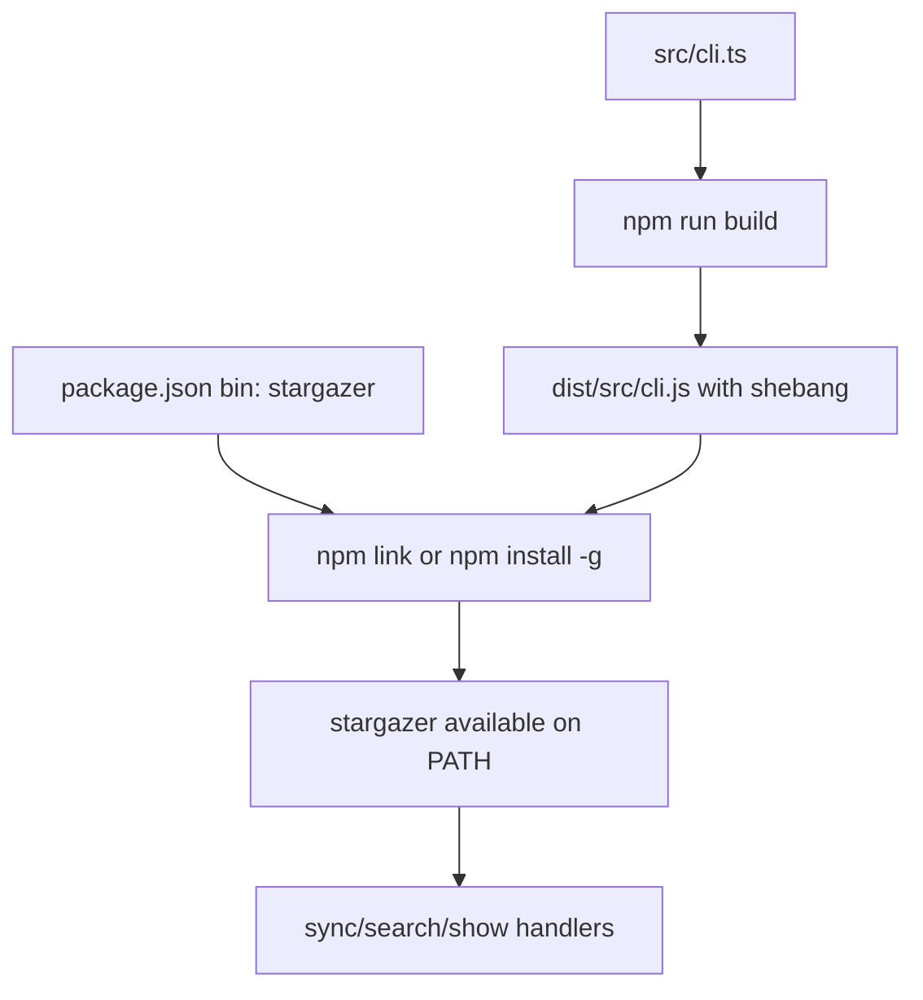

# refactor: Rename and package Stargazer CLI

## Summary

Rename the CLI identity from `github-stars` to `stargazer` and tighten the npm executable workflow so the built command can run as `stargazer` without typing `node`.

---

## Problem Frame

The project already has a working Node.js CLI with a shebang and a `bin` mapping, but its visible identity is still `github-stars` and the README tells users to run `node dist/src/cli.js`. That makes the tool feel like a development script instead of an installable command.

The packaging work should preserve the existing TypeScript build and command behavior while making local linking and global installation use the desired `stargazer` command name.

---

## Requirements

**Identity**

- R1. The package and CLI command identity are renamed from `github-stars` to `stargazer`.
- R2. User-facing help, docs, empty-state guidance, and package metadata consistently use `stargazer`.

**Executable Packaging**

- R3. The npm `bin` entry exposes `stargazer` as the executable command.
- R4. The built CLI entrypoint keeps a valid Node shebang so npm can create Unix symlinks and Windows command shims.
- R5. Local development supports installing or linking the built command so users can run `stargazer sync`, `stargazer search`, and `stargazer show`.

**Compatibility and Verification**

- R6. Existing CLI parsing behavior remains unchanged apart from the command name.
- R7. Tests or package checks verify the `bin` target exists after build and points at the expected executable artifact.
- R8. Documentation no longer requires `node dist/src/cli.js` for normal usage.

---

## Key Technical Decisions

- **Use npm `bin` as the command surface:** npm already supports linking executable package files into the user's PATH through install and link workflows. The plan should refine the existing `bin` mapping rather than introduce shell wrappers or a separate launcher.
- **Keep the compiled TypeScript entrypoint as the bin target:** The current build preserves `src/cli.ts` into `dist/src/cli.js`, including the shebang. Keeping that target avoids moving source files solely for packaging.
- **Rename package metadata with the command:** The package name should become `stargazer` so `npm link` and global install workflows present the same identity as the executable.
- **Defer registry publishing hardening:** This plan targets local/global npm-managed usage. Registry publication details such as package visibility, provenance, release automation, and npm account setup belong in follow-up work if publishing becomes the goal.

---

## High-Level Technical Design

The packaging contract has three moving parts: the source entrypoint must keep the shebang, the build must preserve it in the emitted artifact, and `package.json` must map the command name to that artifact. npm then supplies the platform-specific PATH integration.

---

## Implementation Units

### U1. Rename package and command identity

- **Goal:** Change the visible CLI/package identity from `github-stars` to `stargazer`.
- **Requirements:** R1, R2, R6
- **Dependencies:** None
- **Files:** `package.json`, `package-lock.json`, `src/cli.ts`, `src/search/format.ts`, `src/github/client.ts`, `test/cli.test.ts`, `test/search.test.ts`, `README.md`
- **Approach:** Update package metadata, Commander program name, user-facing guidance strings, and tests that assert the old name. Keep database defaults and environment variable names only if the implementer confirms they are intentionally product-specific rather than command-identity strings.
- **Patterns to follow:** Existing CLI tests already verify help text and command parsing. Continue testing through `createProgram` rather than invoking the process.
- **Test scenarios:**
  - CLI help includes `stargazer` and still lists `sync`, `search`, and `show`.
  - Existing command parsing tests pass with no behavior change to options or arguments.
  - Empty search output tells the user to run the renamed command.
  - User-agent or internal labels use the renamed identity where they represent the tool name.
- **Verification:** No user-facing occurrence of `github-stars` remains unless it is intentionally preserved as a database filename or environment variable compatibility alias.

### U2. Tighten npm executable packaging

- **Goal:** Ensure npm exposes the built command as `stargazer` without requiring `node`.
- **Requirements:** R3, R4, R5, R7
- **Dependencies:** U1
- **Files:** `package.json`, `src/cli.ts`, `test/cli.test.ts`
- **Approach:** Change the `bin` map to `stargazer` and keep it pointed at the built CLI artifact. Add a focused package-contract test that reads package metadata, verifies the `stargazer` bin entry, verifies the target path is the built JavaScript entrypoint, and confirms the source entrypoint starts with a Node shebang.
- **Patterns to follow:** Keep package metadata assertions in tests lightweight and deterministic. Avoid tests that require mutating the user's global npm prefix.
- **Test scenarios:**
  - `package.json` exposes exactly the expected `stargazer` bin command for this CLI.
  - The bin target path resolves to the built CLI artifact location used by the TypeScript build.
  - The source CLI entrypoint starts with `#!/usr/bin/env node`.
  - After a build, the emitted bin target exists and starts with the shebang.
- **Verification:** The package contract is test-covered without requiring an actual global install during normal test runs.

### U3. Document local link and global install usage

- **Goal:** Replace development-script invocations with direct `stargazer` command usage and document how to make the command available.
- **Requirements:** R5, R8
- **Dependencies:** U1, U2
- **Files:** `README.md`
- **Approach:** Update setup instructions to build first, then use npm's local link or global install workflow. Command examples should use `stargazer sync`, `stargazer search`, and `stargazer show`.
- **Patterns to follow:** Keep the README's current structure: setup, quick start, authentication, output, database location, commands, privacy, boundaries.
- **Test scenarios:** Test expectation: none -- documentation-only unit.
- **Verification:** A reader can follow README setup and run the CLI by command name without seeing `node dist/src/cli.js` as the normal path.

### U4. Verify linked-command behavior safely

- **Goal:** Add an implementation-time verification path for direct command execution without depending on the user's global npm state.
- **Requirements:** R5, R6, R7
- **Dependencies:** U2, U3
- **Files:** `package.json`, `test/cli.test.ts`
- **Approach:** Prefer a local package execution check that runs against the built artifact or npm-created local shim if the test harness can do it without global mutation. Keep this as package verification, not a broad end-to-end sync test.
- **Patterns to follow:** Existing tests avoid live GitHub and real user databases. Continue using temp paths and local fixtures for any process-level verification.
- **Test scenarios:**
  - The built command can display help through the executable artifact without specifying `node`.
  - Direct command execution exits successfully for help/no-command behavior.
  - No verification path requires a GitHub token or writes to the default user database.
- **Verification:** The implementer can validate the package command path locally while preserving normal test isolation.

---

## Scope Boundaries

### In Scope

- Rename npm package identity and CLI command name to `stargazer`.
- Update npm `bin` packaging for local link or global install usage.
- Preserve current CLI commands, options, and handler behavior.
- Update README examples to use `stargazer`.
- Add tests or package-contract checks for the executable mapping and shebang.

### Deferred to Follow-Up Work

- Publishing the package to the public npm registry.
- Release automation, package provenance, signing, or installer generation.
- Standalone native binaries or OS-specific installers.
- Renaming persisted database files or environment variables if compatibility becomes important enough to plan separately.

### Out of Scope

- Changing GitHub sync/search/show behavior.
- Changing SQLite schema or stored repository data.
- Adding new CLI commands.
- Replacing npm as the packaging mechanism.

---

## System-Wide Impact

The exported command name changes from `github-stars` to `stargazer`. Any local scripts, aliases, or docs that reference the old command need updating, but the command arguments and options should remain stable.

---

## Risks & Dependencies

- **Build artifact availability:** The `bin` target points into `dist`, so users must build before linking from source unless package lifecycle scripts later automate that step.
- **Windows command shims:** npm handles Windows `.cmd` shims from the `bin` field, but tests should avoid assumptions that only hold on Unix symlinks.
- **Name compatibility:** Renaming package and command identity may leave older local links pointing at `github-stars` until users unlink or reinstall.
- **Over-renaming configuration:** Environment variable names and database defaults may be intentionally stable user data. Treat them as compatibility decisions rather than blindly renaming every string.

---

## Documentation / Operational Notes

- Document the normal local workflow as install dependencies, build, then link or globally install the package.
- Keep direct `node dist/src/cli.js` usage out of Quick Start and command examples.
- Mention that users may need to unlink the old package name if they previously linked `github-stars`.
- Keep `.env` and database guidance consistent with whichever compatibility choice the implementation makes for environment variable and database names.

---

## Sources / Research

- Current package metadata and bin mapping: `package.json`
- Current CLI entrypoint and shebang: `src/cli.ts`
- Current command tests: `test/cli.test.ts`
- Current README examples using `node dist/src/cli.js`: `README.md`
- npm package `bin` documentation: `https://docs.npmjs.com/files/package.json/`
- npm link documentation: `https://docs.npmjs.com/cli/v11/commands/npm-link`
