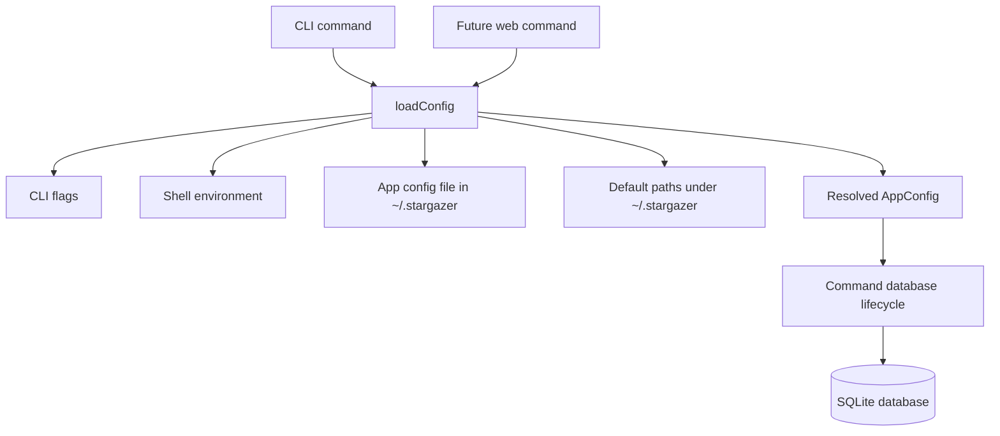

# feat: Add user-global storage

## Summary

Move Stargazer's default database and persistent config to `~/.stargazer` while preserving explicit overrides for tests and advanced users. The plan keeps configuration side effects out of plain config reads, documents manual migration from old project-root databases, and leaves the storage resolver reusable by a future CLI-launched web UI.

---

## Problem Frame

Stargazer now has npm executable packaging, but its default database still resolves against the current working directory. That makes the tool behave like a project-local script after global installation: the same user can accidentally create different databases depending on where they run `stargazer`.

The origin requirements define Stargazer as a personal local app. The implementation should make the personal app directory the default source of truth without removing existing override paths that keep tests isolated and allow advanced database workflows.

---

## Requirements

**Default Storage**

- R1. The default database path resolves to a SQLite file under `~/.stargazer`.
- R2. Default path resolution is stable across `sync`, `search`, `show`, and future commands.
- R3. Running commands from different working directories does not change the default database path.
- R4. The app directory is created only by command paths that need to create or write app data.

**Overrides and Compatibility**

- R5. `--db` continues to override every default database path.
- R6. Environment-based database overrides continue to work for existing users and tests.
- R7. Test helpers and tests can use isolated database paths without touching `~/.stargazer`.
- R8. Existing project-root databases are not auto-moved or deleted.

**Config and Secrets**

- R9. Stargazer reads persistent config from the app directory in addition to shell environment variables.
- R10. CLI flags take precedence over shell environment and persistent config.
- R11. Shell environment variables take precedence over persistent config.
- R12. GitHub token loading supports persistent config, shell environment, and `--token`.
- R13. Documentation warns that token-bearing config files are sensitive local files.

**Future Web UI Contract**

- R14. The storage/config resolver is command-agnostic so a future web command can use the same app directory and database.
- R15. The plan does not implement the web UI or a long-running daemon.

---

## Key Technical Decisions

- **Keep `loadConfig` as the public configuration boundary:** The existing CLI already routes all command handlers through `loadConfig`, so extending it preserves the current architecture and avoids a parallel runtime config system.
- **Use an app-directory dotenv file for persistent config:** The project already depends on `dotenv`. Loading a `config.env`-style file from `~/.stargazer` gives users the requested config-file workflow without adding a new parser or dependency.
- **Stop treating the working directory as config home:** Project-root `.env` loading made sense for development, but packaged runtime config should come from flags, shell environment, or the app-directory config file.
- **Preserve existing environment variable names first:** The current code and docs use `GITHUB_STARS_DB`, `GITHUB_TOKEN`, and `GH_TOKEN`. The plan should preserve those names for compatibility and defer any broader rename to a separate compatibility decision.
- **Do not create app state during config reads:** Resolving configuration should be pure path and value resolution. Directory creation belongs in the command/database lifecycle where the command is about to create or mutate local app data.
- **Plan only the shared storage contract for web:** The future browser UI needs the same resolved app directory and database, but server startup, URL opening, routing, and shutdown behavior remain a later web implementation plan.
- **Treat old project-root databases as manual migration:** Automatic discovery or movement of `.github-stars.sqlite` risks moving data the user did not intend to promote into the global store.

---

## High-Level Technical Design

Configuration resolution should combine four sources in descending precedence: CLI flags, shell environment, app-directory config, and defaults. The command database lifecycle decides whether to create the app directory before opening the resolved database.

---

## Implementation Units

### U1. Resolve user-global app config

- **Goal:** Teach configuration loading to resolve `~/.stargazer`, read persistent config from that directory, and default the database path there.
- **Requirements:** R1, R2, R3, R5, R6, R7, R9, R10, R11, R12, R14
- **Dependencies:** None
- **Files:** `src/config.ts`, `test/config.test.ts`
- **Approach:** Extend the existing config boundary so it can derive a default app directory from the user's home directory, load an app-directory config file, and merge flags, environment, persistent config, and defaults in the required precedence order. Keep the resolver command-agnostic so a future web command can reuse the same app directory and database without duplicating path logic. Keep test entry points injectable enough that config tests can use temporary directories and synthetic environments without depending on the real user home.
- **Patterns to follow:** Keep the current `loadConfig(options, env)` shape as the main test surface. Continue using `dotenv` for key-value config parsing instead of introducing a new config format.
- **Test scenarios:**
  - With no overrides, database path resolves under a temporary `~/.stargazer` equivalent rather than the mocked current working directory.
  - `--db` wins over shell environment, app config, and defaults.
  - Shell `GITHUB_STARS_DB` wins over app config and defaults.
  - A token in app config is used when no token flag or shell token exists.
  - `--token` wins over shell token and app config token.
  - Shell `GITHUB_TOKEN` or `GH_TOKEN` wins over app config token.
  - A `.env` file in the current working directory does not override app-directory config during packaged runtime config loading.
  - Loading config in a test with a synthetic home directory does not create directories or files.
- **Verification:** Config tests prove path stability across working directories and precedence across all supported sources.

### U2. Control database and directory creation behavior

- **Goal:** Ensure commands that create or mutate app data create the parent app directory deliberately, while read-style paths avoid creating user state when the default database does not exist.
- **Requirements:** R2, R3, R4, R7, R8, R14
- **Dependencies:** U1
- **Files:** `src/cli.ts`, `src/db/connection.ts`, `test/cli.test.ts`, `test/config.test.ts`
- **Approach:** Add a small database-opening or command-lifecycle boundary that can ensure a database parent directory exists when the command is about to write app data. Preserve explicit `--db` behavior by ensuring custom database parent directories only when opening would otherwise fail for a write-capable command. For default read paths where no database exists yet, prefer a clean "run sync first" outcome over silently creating `~/.stargazer`.
- **Patterns to follow:** Keep schema initialization close to database opening, as the current handlers already do. Keep CLI tests focused on command behavior and config tests focused on path/precedence behavior.
- **Test scenarios:**
  - `sync` with the default database creates the app directory before opening SQLite.
  - `search` from an empty default app state reports the existing empty-state guidance without creating the app directory or database.
  - `show` from an empty default app state fails or reports absence without creating the app directory or database.
  - Commands using `--db` keep using the explicit path rather than the default app directory.
  - Search after sync reads the same default database from a different mocked working directory.
- **Verification:** Command-level tests prove the default database is shared across directories and that read-style empty-state behavior avoids accidental user-state creation.

### U3. Update user-facing setup, storage, and privacy docs

- **Goal:** Make the README match the packaged user-global storage behavior and explain the privacy implications of persistent config.
- **Requirements:** R1, R5, R6, R8, R9, R12, R13, R15
- **Dependencies:** U1, U2
- **Files:** `README.md`
- **Approach:** Replace project-root `.env` and current-directory database guidance with app-directory config and database guidance. Document `--db` and environment overrides as advanced paths. Add a manual migration note for users who already have `.github-stars.sqlite` in a project checkout.
- **Patterns to follow:** Keep the README's existing sections: setup, quick start, authentication, database location, commands, privacy, and boundaries.
- **Test scenarios:** Test expectation: none -- documentation-only unit.
- **Verification:** A reader can install Stargazer globally, configure a token, understand where local data is stored, and understand that old project-root databases are not migrated automatically.

### U4. Verify package and regression coverage

- **Goal:** Keep the global npm command workflow covered after the default storage change.
- **Requirements:** R2, R3, R7, R14
- **Dependencies:** U1, U2, U3
- **Files:** `test/verify-bin.mjs`, `test/cli.test.ts`, `package.json`
- **Approach:** Extend existing package verification only where necessary to ensure the packaged command can still show help without creating user app state. Keep global-install simulation isolated in temporary directories.
- **Patterns to follow:** Reuse the current temp-prefix package verification script and avoid mutating the user's real npm prefix or real home directory.
- **Test scenarios:**
  - The linked `stargazer --help` path still exits successfully.
  - Help rendering does not create a default app directory.
  - Existing command parsing tests continue to pass with the same public command names and options.
- **Verification:** Package verification remains safe to run locally and confirms the executable path did not regress while storage defaults changed.

---

## Acceptance Examples

- AE1. Same database from different directories
  - **Covers:** R1, R2, R3
  - **Given:** The user has globally installed Stargazer and synced their stars.
  - **When:** The user runs `stargazer search sqlite` from a different working directory.
  - **Then:** Stargazer searches the same user-global database created by sync.

- AE2. Explicit database override
  - **Covers:** R5, R6, R7
  - **Given:** The user provides a custom database path.
  - **When:** The user runs a command with that override.
  - **Then:** Stargazer uses the custom database path instead of the default database under `~/.stargazer`.

- AE3. Config and environment precedence
  - **Covers:** R9, R10, R11, R12
  - **Given:** A persistent config value exists and the user provides a flag for the same setting.
  - **When:** Stargazer loads configuration for a command.
  - **Then:** The flag value wins for that command.

- AE4. Future web command storage contract
  - **Covers:** R14, R15
  - **Given:** A future web command needs to read stored repositories.
  - **When:** It uses the shared configuration boundary.
  - **Then:** It resolves the same app directory and database as `sync`, `search`, and `show`.

---

## Scope Boundaries

### In Scope

- Default database path under `~/.stargazer`.
- Persistent app-directory config loaded alongside shell environment and CLI flags.
- Directory creation behavior for command paths that create or mutate local app data.
- README updates for setup, database location, manual migration, and config-file privacy.
- Tests for path resolution, precedence, read-path side effects, and package help behavior.

### Deferred to Follow-Up Work

- Adding `STARGAZER_*` environment variable aliases or renaming existing `GITHUB_STARS_*` variables.
- Automatic migration from existing project-root SQLite databases.
- System keychain or credential-manager integration.
- OS-native app data directories.
- Named profiles or multiple first-class indexes.
- Implementing the future `web` command or browser UI.

### Out of Scope

- Hosted multi-user access.
- Direct browser access to SQLite.
- Changing synced GitHub repository or Star List schema.
- Replacing npm packaging.

---

## System-Wide Impact

This change alters the default persistence contract for every CLI command that opens the database. It should reduce accidental per-directory databases for installed users, but it also means contributors and tests must use explicit database overrides when they want project-local or temporary state.

The future web UI benefits from this work because it can share the same storage/config resolver without inventing a second app-state location.

---

## Risks & Dependencies

- **Token file privacy:** Persistent config may contain a GitHub token, so docs need to make local file sensitivity clear.
- **Behavior shift for current users:** Users with an existing `.github-stars.sqlite` in the checkout will not see that data from the new default path unless they pass `--db` or migrate manually.
- **Read-path side effects:** SQLite opens can create files. The implementation needs explicit handling so read-style commands do not create default app state when no sync has happened.
- **Windows home resolution:** `~/.stargazer` is a conceptual path; implementation should resolve it through Node's home-directory facilities rather than string concatenation.

---

## Sources / Research

- `docs/brainstorms/2026-06-05-user-global-storage-requirements.md`
- `STRATEGY.md`
- `README.md`
- `src/config.ts`
- `src/cli.ts`
- `src/db/connection.ts`
- `test/config.test.ts`
- `test/cli.test.ts`
- `test/verify-bin.mjs`
- `docs/plans/2026-06-05-001-refactor-stargazer-cli-packaging-plan.md`
