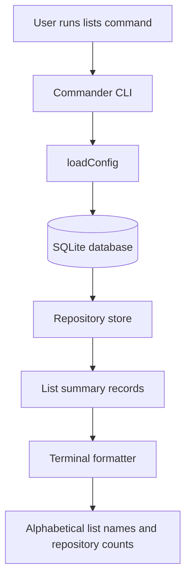

# feat: List GitHub Star Lists with repository counts

## Summary

Add a read-only CLI surface that lists every synced GitHub Star List alphabetically with the number of repositories currently stored for each list. The plan extends Stargazer's existing local SQLite and Commander patterns without adding live GitHub calls or changing sync behavior.

---

## Problem Frame

Stargazer already syncs GitHub Star Lists and list membership into SQLite, and search can match repositories through list names. A user still lacks a quick inventory view of their own Star Lists: which lists exist locally, and how many repositories each one contains after the most recent sync.

This feature supports the same local-first retrieval loop from `docs/brainstorms/2026-06-04-github-star-search-requirements.md`. It exposes list-level context from the local store while preserving GitHub as the source of truth and keeping private list metadata local.

---

## Requirements

**List Summary**

- R1. The CLI provides a command that lists all locally synced GitHub Star Lists.
- R2. The command sorts Star Lists alphabetically by list name using stable, case-insensitive ordering.
- R3. Each listed Star List shows its repository count based on local `repo_list_memberships` rows.
- R4. Star Lists with zero repositories are included with a count of `0`.
- R5. Public and private Star Lists use the same output path; privacy is not used to filter or hide locally stored lists.

**Local Read Behavior**

- R6. The command reads only from the local SQLite database and does not contact GitHub.
- R7. Running the command before a default database exists reports a sync-first empty state without creating the app directory or database.
- R8. Explicit database overrides continue to work for isolated or advanced workflows.

**User-Facing Contract**

- R9. The output is compact and terminal-friendly for scanning list names and counts.
- R10. README command documentation includes the new list-summary workflow and preserves existing privacy language.

---

## Key Technical Decisions

- **Add a dedicated `lists` command:** A first-class command is easier to discover than overloading `search`, and it matches the existing `sync`, `search`, and `show` command model.
- **Read counts from membership joins:** Counts should reflect the locally synced membership table, including zero-count lists through a left join, rather than deriving from search results.
- **Keep formatting separate from storage:** Following `search` and `inspect`, the query result and terminal rendering should live behind a small feature module instead of embedding display logic in `src/cli.ts`.
- **No schema migration for this feature:** The existing `star_lists` and `repo_list_memberships` tables already contain the required data.
- **Reuse read-command empty-state behavior:** The new command should behave like `search` and `show` for missing default app state, avoiding accidental creation of `~/.stargazer`.

---

## High-Level Technical Design

The new behavior should follow the existing read-command lifecycle: resolve configuration, avoid opening a missing default database, initialize schema only after a database is intentionally opened, read from the repository store, then render compact terminal output.

---

## Implementation Units

### U1. Add list-summary query to the repository store

- **Goal:** Expose all locally stored Star Lists with repository counts in alphabetical order.
- **Requirements:** R1, R2, R3, R4, R5, R6
- **Dependencies:** None
- **Files:** `src/db/repositories.ts`, `test/repositories.test.ts`
- **Approach:** Add a store method that selects from `star_lists`, left joins `repo_list_memberships`, groups by list identity, counts memberships, and orders by normalized list name plus a stable tie-breaker. Return a typed list-summary record so CLI and formatting layers do not need to know SQL details.
- **Patterns to follow:** Keep SQL access inside `createRepositoryStore`, as existing `searchMetadata`, `findReposByListName`, and `listMemberships` do.
- **Test scenarios:**
  - A store containing public and private lists returns both lists through the same query path.
  - Lists are ordered alphabetically when inserted in non-alphabetical order.
  - A list with two memberships reports count `2`.
  - A synced list with no memberships reports count `0`.
  - Lists with equal names differing only by case have deterministic secondary ordering.
- **Verification:** Repository tests prove the store can produce the exact local list inventory without requiring search or inspect code paths.

### U2. Create list-summary domain and formatter

- **Goal:** Keep list inventory behavior and terminal output separate from CLI command parsing.
- **Requirements:** R1, R2, R3, R4, R5, R9
- **Dependencies:** U1
- **Files:** `src/lists/lists.ts`, `test/lists.test.ts`
- **Approach:** Add a small feature module that calls the store's list-summary method and formats records as compact rows containing the Star List name and repository count. Include an empty-state message for databases that exist but contain no synced lists.
- **Patterns to follow:** Mirror the split used by `src/search/search.ts` plus `src/search/format.ts` and `src/inspect/inspect.ts`, while keeping this feature simple enough to avoid unnecessary abstractions.
- **Test scenarios:**
  - Formatting two lists shows each list name and count on scan-friendly output lines.
  - Formatting an empty local database tells the user to run sync first.
  - Private and public lists are formatted identically, and the default output does not include visibility markers.
  - Long list names do not prevent the count from being visible in the same row or immediately adjacent text.
- **Verification:** Feature tests prove the formatter is usable independently from Commander and database-opening behavior.

### U3. Wire the CLI command and read lifecycle

- **Goal:** Add the user-facing command and connect it to the existing local read path.
- **Requirements:** R1, R6, R7, R8, R9
- **Dependencies:** U1, U2
- **Files:** `src/cli.ts`, `test/cli.test.ts`
- **Approach:** Extend `CliHandlers` with a list-summary handler and add a Commander command for listing Star Lists. The default handler should resolve config, short-circuit a missing default database with the same sync-first posture as `search`, and otherwise open SQLite, initialize schema, query summaries, and write formatted output.
- **Patterns to follow:** Keep command parsing in `createProgram`, default runtime behavior in `createDefaultHandlers`, and missing-default-database handling consistent with existing read commands.
- **Test scenarios:**
  - CLI help includes the new list-summary command alongside `sync`, `search`, and `show`.
  - Command parsing passes `--db` through to the new handler.
  - Running the command from empty default app state reports a sync-first message and does not create `~/.stargazer` or the database.
  - Running the command with an explicit missing database path initializes that database and reports an empty local list state.
  - After sync writes list data, the command reads the same default database from another working directory.
  - Running the command with a network guard or failing GitHub client path proves no GitHub API request is made.
- **Verification:** Command tests prove the public CLI contract, config override behavior, and read-side side-effect boundary.

### U4. Document the list inventory workflow

- **Goal:** Make the README describe how users can inspect their synced Star Lists and counts.
- **Requirements:** R9, R10
- **Dependencies:** U3
- **Files:** `README.md`
- **Approach:** Add the command to Quick Start, Commands, terminal output examples, and Current Boundaries where relevant. Keep wording clear that the command reads local data from the last sync and does not create or edit GitHub Star Lists.
- **Patterns to follow:** Preserve the README's current sections and privacy posture rather than adding a new conceptual model.
- **Test scenarios:** Test expectation: none -- documentation-only unit.
- **Verification:** A reader can sync, list Star Lists with counts, search, and show repositories while understanding that private list data remains local.

---

## Acceptance Examples

- AE1. Alphabetical list inventory
  - **Covers:** R1, R2, R3, R9
  - **Given:** The local store contains Star Lists named "Tools" and "AI" with synced membership.
  - **When:** The user runs the list-summary command.
  - **Then:** "AI" appears before "Tools", and each row shows the repository count for that list.

- AE2. Empty synced list
  - **Covers:** R1, R3, R4
  - **Given:** The local store contains a Star List with no current repository memberships.
  - **When:** The user lists Star Lists.
  - **Then:** The list appears with count `0`.

- AE3. Private list stays local
  - **Covers:** R5, R6
  - **Given:** The local store contains a private GitHub Star List.
  - **When:** The user lists Star Lists.
  - **Then:** The private list appears from local data without a GitHub request or publication step.

- AE4. Missing default database
  - **Covers:** R7
  - **Given:** The user has not synced and the default database path does not exist.
  - **When:** The user runs the list-summary command.
  - **Then:** Stargazer reports that the user should run sync first and does not create app state.

---

## Scope Boundaries

### In Scope

- A read-only CLI command for listing synced GitHub Star Lists.
- Alphabetical list-name sorting.
- Repository counts derived from local list membership.
- Empty states for missing or empty local databases.
- Tests for store query behavior, formatting, command parsing, and read-side side effects.
- README updates for the new command.

### Deferred to Follow-Up Work

- Filtering repositories by choosing a list from the inventory output.
- Showing list descriptions, slugs, visibility, or last-updated timestamps by default.
- JSON or machine-readable output modes.
- Interactive terminal selection.
- Creating, editing, deleting, or publishing GitHub Star Lists.

### Out of Scope

- Changing GitHub sync query behavior.
- Changing the SQLite schema.
- Contacting GitHub when listing local Star Lists.
- README text indexing, semantic search, embeddings, local notes, or a web UI.

---

## System-Wide Impact

This change adds a new public CLI command but stays within Stargazer's existing local read model. It should not alter sync, search, inspect, storage defaults, or GitHub API behavior.

The command gives users a quick health check for synced list coverage: missing counts or empty output can indicate that sync has not run or did not fetch list membership successfully.

---

## Risks & Dependencies

- **Command naming ambiguity:** `lists` is discoverable, but implementation should avoid conflicting with internal "Star List" terminology in docs and help text.
- **Count accuracy depends on sync freshness:** Counts reflect the local database only. README wording should avoid implying a live GitHub count.
- **Read-path side effects:** The new command must preserve the no-create behavior for missing default app state.
- **Output growth:** Users with many Star Lists need output that remains line-oriented and sortable without decorative formatting that hurts scanning.

---

## Sources / Research

- `docs/brainstorms/2026-06-04-github-star-search-requirements.md`
- `STRATEGY.md`
- `README.md`
- `src/cli.ts`
- `src/db/repositories.ts`
- `src/db/schema.ts`
- `src/search/search.ts`
- `src/search/format.ts`
- `src/inspect/inspect.ts`
- `test/cli.test.ts`
- `test/repositories.test.ts`
- `test/helpers.ts`
- `docs/plans/2026-06-04-001-feat-github-star-search-cli-plan.md`
- `docs/plans/2026-06-05-002-feat-user-global-storage-plan.md`
