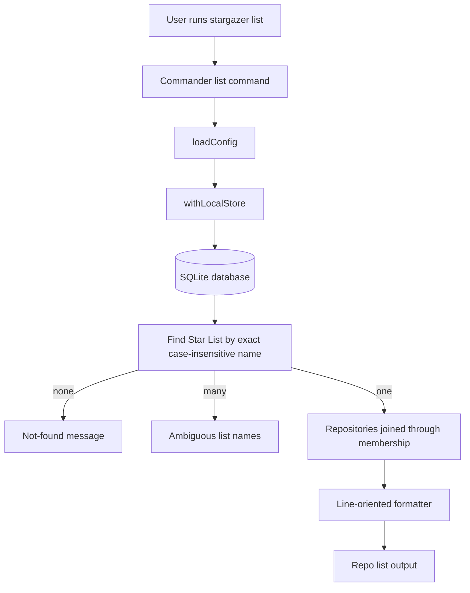

# feat: List repositories in a GitHub Star List

## Summary

Add `stargazer list <list_name>` so a user can print every locally synced repository in one GitHub Star List. The command resolves the Star List name case-insensitively, reads only from the local SQLite database, and keeps the existing `stargazer lists` inventory command as the discovery path.

---

## Problem Frame

Stargazer can already sync Star List membership, search by list name, inspect a repository's memberships, and list all Star Lists with counts. The missing retrieval step is the inverse of `show`: after seeing a list name through `stargazer lists`, the user should be able to inspect the repositories inside that exact list without remembering a repository-specific query.

This extends the local-first search workflow from `docs/brainstorms/2026-06-04-github-star-search-requirements.md` while preserving GitHub as the sync-time source of truth.

---

## Requirements

**List Detail**

- R1. The CLI provides `stargazer list <list_name>` for listing repositories in one locally synced GitHub Star List.
- R2. The command resolves `<list_name>` as an exact Star List name match with case-insensitive comparison.
- R3. The command returns all repositories in the matched list, sorted by repository full name for stable scanning.
- R4. Public and private Star Lists use the same command behavior and output path.

**Local Read Behavior**

- R5. The command reads only from the local SQLite database and does not contact GitHub.
- R6. Running the command before a default database exists reports a sync-first message without creating the app directory or database.
- R7. Explicit database overrides continue to initialize and read the requested database path.

**User-Facing Contract**

- R8. If no Star List matches the provided name, the command says no local Star List was found and points the user toward `stargazer lists`.
- R9. If multiple locally stored Star Lists match only by case, the command reports ambiguity and prints the matching stored names.
- R10. The output is compact enough to scan a list of repositories and includes enough repository identity to use with `stargazer show`.
- R11. README command documentation covers the new list-detail workflow and clarifies that results reflect the last local sync.

---

## Key Technical Decisions

- **Use singular `list` for list detail:** `lists` remains the inventory command, while `list <list_name>` reads naturally as "show this list." Commander can expose both commands without changing existing users' `stargazer lists` workflow.
- **Resolve by exact case-insensitive name:** The user chooses from names shown by `stargazer lists`, so substring matching would make accidental broad matches more likely. Search already covers fuzzy list-name discovery.
- **Surface ambiguity instead of picking a case variant:** GitHub may prevent duplicate list names in practice, but the local schema does not. Reporting ambiguity avoids showing the wrong private list when two stored names differ only by case.
- **Keep SQL in the repository store:** The membership join belongs beside `listSummaries`, `findReposByListName`, and `listMemberships`; the CLI should only coordinate config, local-store lifecycle, and formatting.
- **Reuse the local read lifecycle:** The new command should follow `search`, `show`, and `lists` through `withLocalStore` so missing default databases remain side-effect free.

---

## High-Level Technical Design

---

## Implementation Units

### U1. Add exact Star List repository lookup to the store

- **Goal:** Expose a typed store method that resolves one Star List name and returns repositories in that list.
- **Requirements:** R2, R3, R4, R5, R8, R9
- **Dependencies:** None
- **Files:** `src/db/repositories.ts`, `test/repositories.test.ts`
- **Approach:** Add a store method such as `findRepositoriesInListByName(name)` that first finds `star_lists` rows where `lower(name) = lower(?)`, then returns a discriminated result for `not-found`, `ambiguous`, or `found`. For the found case, join through `repo_list_memberships` to `repositories` and order by `lower(r.full_name), r.full_name, r.id`.
- **Patterns to follow:** Keep mapping through existing `mapRepoRow` and `mapListRow` helpers. Follow `listSummaries` for list-related SQL and `findRepositoryCandidates` for result states that distinguish not-found, ambiguous, and found.
- **Test scenarios:**
  - A lowercase input matches a stored mixed-case list name.
  - A stored public list and a stored private list use the same lookup path.
  - A list with two repositories returns both repositories sorted by full name.
  - A list with no memberships returns a found result with an empty repository array.
  - An unknown list name returns `not-found`.
  - Two list rows with names equal under lowercase comparison return `ambiguous` with both stored names.
- **Verification:** Store tests prove the command can be implemented without fuzzy search or GitHub access.

### U2. Add list-detail domain result and formatter

- **Goal:** Convert store lookup states into terminal output that is useful from the CLI and easy to test without Commander.
- **Requirements:** R1, R3, R8, R9, R10
- **Dependencies:** U1
- **Files:** `src/lists/lists.ts`, `test/lists.test.ts`
- **Approach:** Extend the existing lists feature module with a function such as `listStarListRepositories(store, name)` and a formatter such as `formatStarListRepositories(result)`. The found output should be line-oriented and include repository full names; include URL, language, or description only if the format stays compact and consistent with README examples.
- **Patterns to follow:** Keep `formatStarLists` intact for the plural inventory command. Mirror `inspectRepository` and `formatInspection` for discriminated result handling.
- **Test scenarios:**
  - A found list with repositories prints each repository full name on a separate scan-friendly line.
  - A found list with no repositories reports that the local Star List is empty.
  - A not-found result includes the requested name and recommends `stargazer lists`.
  - An ambiguous result prints the conflicting stored list names.
  - Output does not expose private/public markers unless already used for the specific result type.
- **Verification:** Feature tests prove the terminal contract independently from database-opening behavior.

### U3. Wire `stargazer list <list_name>` into the CLI

- **Goal:** Add the public command and connect it to the existing local read path.
- **Requirements:** R1, R2, R5, R6, R7, R8, R9, R10
- **Dependencies:** U1, U2
- **Files:** `src/cli.ts`, `test/cli.test.ts`
- **Approach:** Extend `CliHandlers` with `list(name, options)`, add a Commander `list` command with a required `<list_name>` argument, and implement the default handler through `withLocalStore`. The missing-default branch should reuse the sync-first posture used by `search` and `lists`.
- **Patterns to follow:** Keep `createProgram` responsible for command parsing, keep `createDefaultHandlers` responsible for runtime behavior, and avoid token or GitHub client setup for local read commands.
- **Test scenarios:**
  - CLI help includes both `list` and `lists` with distinct descriptions.
  - Command parsing passes `<list_name>` and `--db` into the handler.
  - Quoted names with spaces parse as one list-name argument.
  - Running from empty default app state reports a sync-first message and does not create `~/.stargazer` or the database.
  - Running with an explicit missing database initializes that database and reports no matching local Star List.
  - After sync writes list data, the command reads the same default database from another working directory.
  - A network guard proves the command does not call `fetch`.
- **Verification:** CLI tests cover the public command contract and the local read side-effect boundary.

### U4. Document the list-detail workflow

- **Goal:** Make the README show how `lists`, `list`, `search`, and `show` fit together.
- **Requirements:** R1, R8, R10, R11
- **Dependencies:** U3
- **Files:** `README.md`
- **Approach:** Add `stargazer list "Private Tools"` to Quick Start, Commands, database override examples, and terminal output examples. Describe the command as local and last-sync based.
- **Patterns to follow:** Preserve the README's current local-only and privacy language; do not introduce live GitHub list browsing language.
- **Test scenarios:** Documentation-only expectation: examples use the actual command name and quote list names containing spaces.
- **Verification:** A reader can discover list names with `stargazer lists`, inspect one list with `stargazer list <list_name>`, then inspect a repository with `stargazer show`.

---

## Acceptance Examples

- AE1. Case-insensitive list detail
  - **Covers:** R1, R2, R3
  - **Given:** The local store contains a Star List named "Private Tools" with two repositories.
  - **When:** The user runs `stargazer list "private tools"`.
  - **Then:** Stargazer prints both repositories from "Private Tools" in stable full-name order.

- AE2. Empty Star List
  - **Covers:** R1, R3, R10
  - **Given:** The local store contains a Star List with no current repository memberships.
  - **When:** The user runs `stargazer list "<list_name>"`.
  - **Then:** Stargazer reports that the local Star List is empty instead of treating the list as missing.

- AE3. Unknown list name
  - **Covers:** R8
  - **Given:** The local store contains synced Star Lists but none named "Tools".
  - **When:** The user runs `stargazer list Tools`.
  - **Then:** Stargazer reports no local Star List named "Tools" and suggests `stargazer lists`.

- AE4. Missing default database
  - **Covers:** R5, R6
  - **Given:** The user has not synced and the default database path does not exist.
  - **When:** The user runs `stargazer list Tools`.
  - **Then:** Stargazer reports a sync-first message and does not create app state.

- AE5. Ambiguous case variants
  - **Covers:** R2, R9
  - **Given:** The local store contains Star Lists named "Tools" and "tools".
  - **When:** The user runs `stargazer list tools`.
  - **Then:** Stargazer reports the ambiguous local Star List names and asks for the exact stored spelling or a future disambiguation mechanism.

---

## Scope Boundaries

### In Scope

- A read-only CLI command for listing repositories in one synced GitHub Star List.
- Exact case-insensitive Star List name resolution.
- Not-found, empty-list, and ambiguous-list output states.
- Local SQLite reads using the existing default database behavior.
- Tests for store query behavior, formatting, command parsing, and read-side side effects.
- README updates for the new command.

### Deferred to Follow-Up Work

- JSON or machine-readable output.
- Pagination, limiting, or sorting flags for very large lists.
- Interactive list selection from `stargazer lists`.
- Matching by GitHub list slug or internal list ID.
- Opening repositories directly from the list output.

### Out of Scope

- Changing GitHub sync queries.
- Changing the SQLite schema.
- Contacting GitHub when listing repositories in a Star List.
- Creating, editing, deleting, or publishing GitHub Star Lists.
- Replacing `search` list-name matching with exact filtering.

---

## System-Wide Impact

This change adds one public CLI command and one local membership lookup. It should not alter sync behavior, search ranking, repository inspection, schema initialization, or the existing `stargazer lists` command.

The command increases the value of synced Star List membership by making list inventory actionable: `lists` shows what exists, and `list <list_name>` shows the saved repositories inside one list.

---

## Risks & Dependencies

- **Command-name proximity:** `list` and `lists` differ by one character, so descriptions and README examples need to make the singular/plural distinction obvious.
- **Ambiguous local data:** The schema allows case-only duplicate list names, so implementation must avoid silently selecting one.
- **Output scale:** Some Star Lists may contain many repositories. The first version should stay line-oriented and defer pagination until it is needed.
- **Sync freshness:** Results reflect local data from the last sync. Documentation should avoid implying live GitHub state.

---

## Sources / Research

- `docs/brainstorms/2026-06-04-github-star-search-requirements.md`
- `docs/plans/2026-06-06-001-feat-star-list-summary-plan.md`
- `README.md`
- `STRATEGY.md`
- `src/cli.ts`
- `src/db/repositories.ts`
- `src/db/schema.ts`
- `src/lists/lists.ts`
- `src/search/search.ts`
- `src/search/format.ts`
- `src/inspect/inspect.ts`
- `test/cli.test.ts`
- `test/repositories.test.ts`
- `test/lists.test.ts`
- `test/helpers.ts`
